# Mixtape — Mermaid Diagrams

Supporting diagrams for `submission.md`. GitHub renders Mermaid in Markdown previews.

> **Note:** Diagrams for Issues #1 and #5 below describe **pre-fix investigation** (symptoms and call flow). Update or add post-fix diagrams in each RCA section after you commit the fix.

---

## 1. Project workflow (what this homework asks you to do)

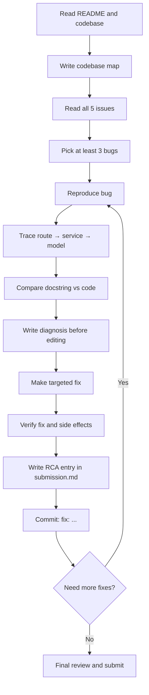

---

## 2. Codebase architecture (layers)

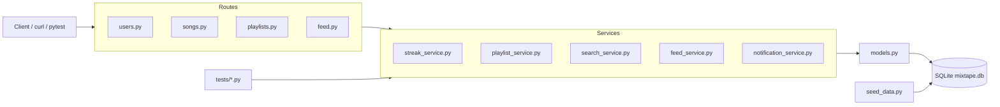

---

## 3. Per-bug debugging lifecycle

```mermaid
stateDiagram-v2
    [*] --> Reproduce
    Reproduce --> Trace
    Trace --> Diagnose
    Diagnose --> Fix
    Fix --> Verify
    Verify --> DocumentRCA
    DocumentRCA --> Commit
    Commit --> [*]

    Reproduce: Trigger bug before editing code
    Trace: Follow route → service → model
    Diagnose: Docstring contract vs implementation
    Fix: Smallest targeted change
    Verify: Failing test passes; no regressions
    DocumentRCA: All 5 required fields
    Commit: One conventional fix: commit per bug
```

---

## 4. Diagnosis workflow (diagnose before guessing)

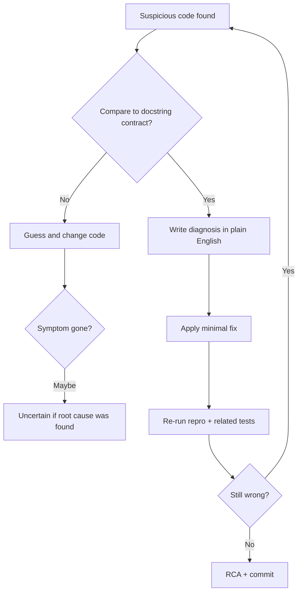

---

## 5. Issue #1 — Streak (Saturday → Sunday)

**Repro:** `pytest tests/test_streaks.py::test_streak_increments_on_sunday -v`

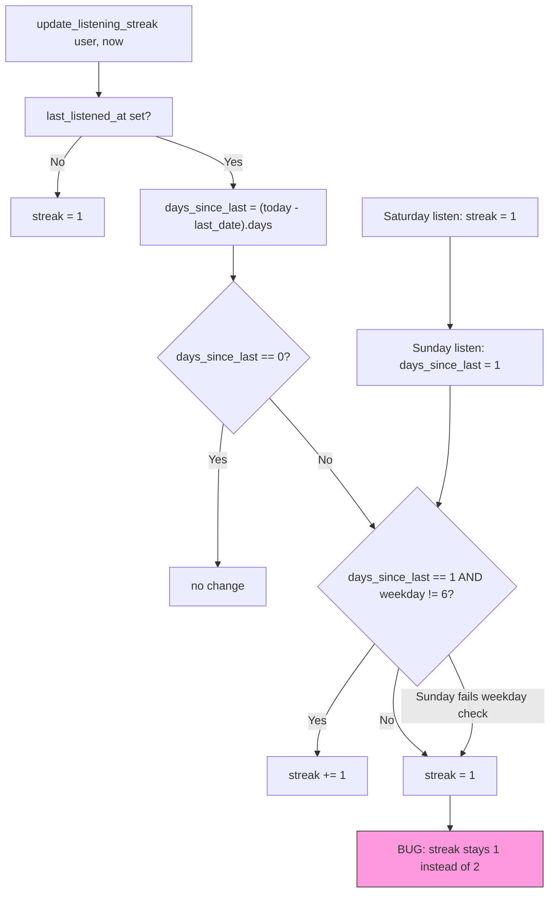

**Contract (docstring):** consecutive **calendar days** increment the streak.  
**Investigation focus:** `weekday()` is weekday-based, not calendar-day based.

---

## 6. Issue #5 — Playlist missing last song

**Repro:** `pytest tests/test_playlists.py -v` or `GET /playlists/<id>/songs`

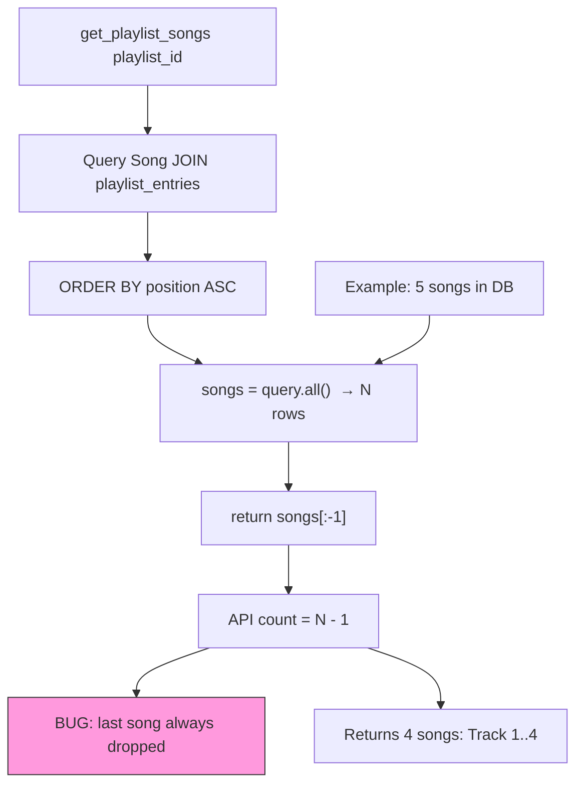

**Contract (docstring):** returns **all** songs in playlist order.  
**Investigation focus:** compare query row count vs returned list length.

---

## 7. Issue #3 — Search duplicates (conditional)

**Repro:** `GET /songs/search?q=...` — unit tests may pass; bug can be conditional.

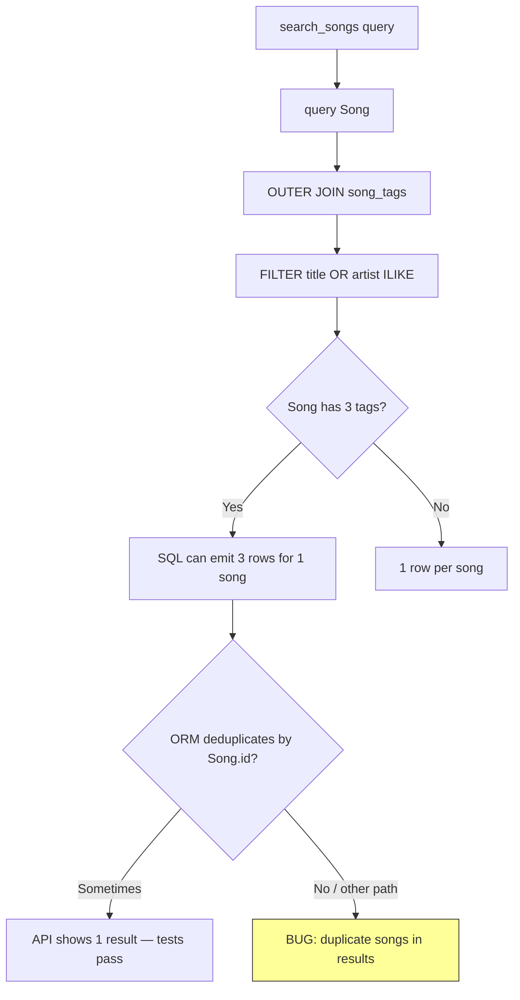

**Investigation focus:** raw SQL row count vs `query(Song).all()` length vs JSON `count`.

---

## 8. Issue #2 — Friends Listening Now (stale events)

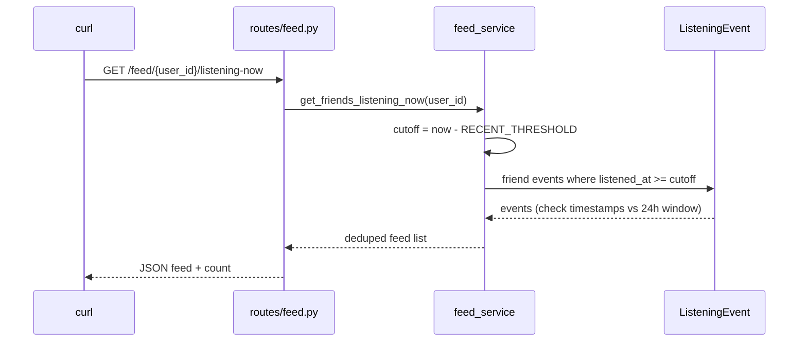

**Investigation focus:** `RECENT_THRESHOLD` and whether old events pass the cutoff filter.

---

## 9. Issue #4 — Missing rating notification

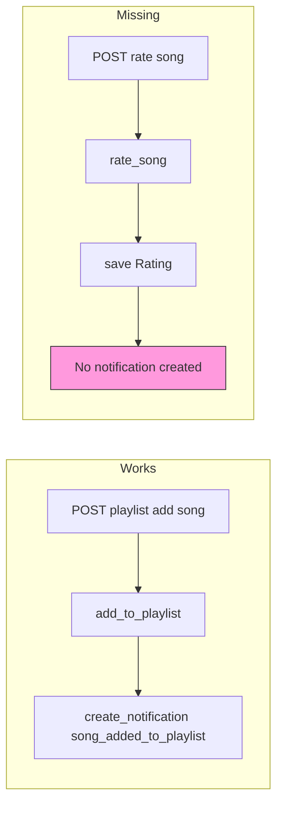

**Investigation focus:** compare `rate_song()` to the working `add_to_playlist()` notification pattern.

---

## 10. RCA entry structure (required fields)

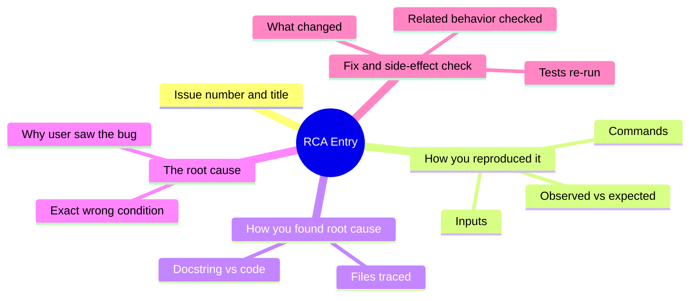

---

## 11. Git commit model (one fix per commit)

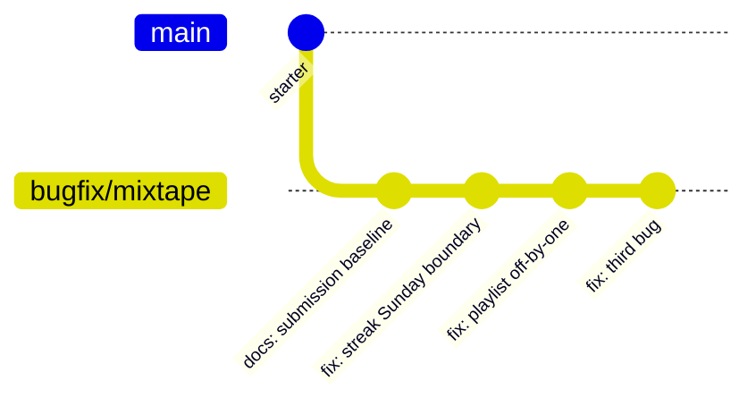
