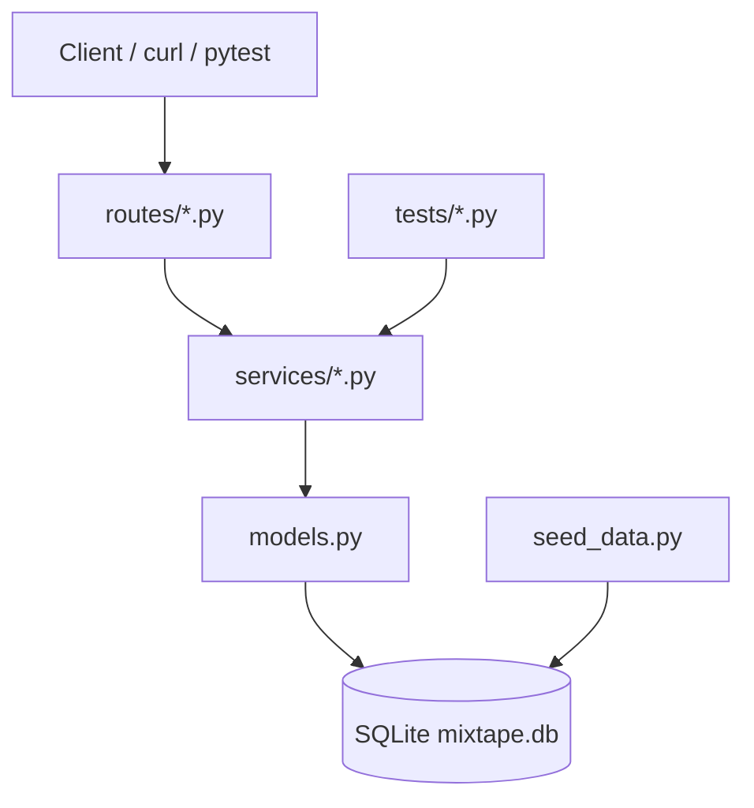
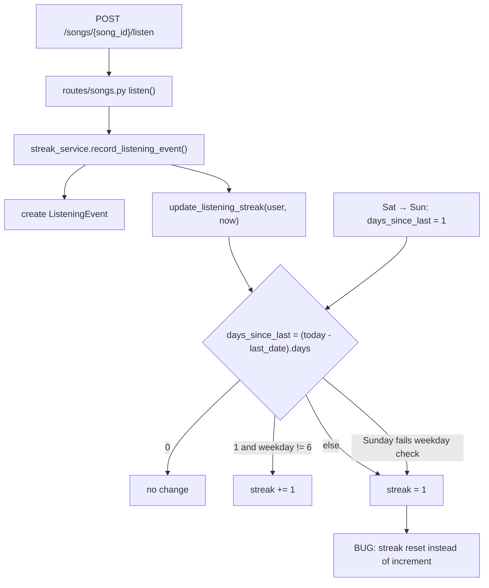
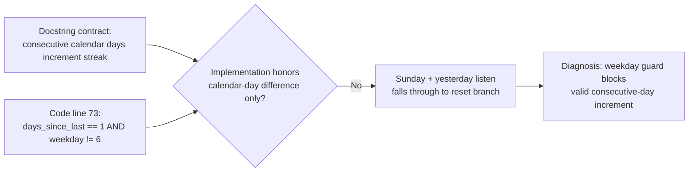
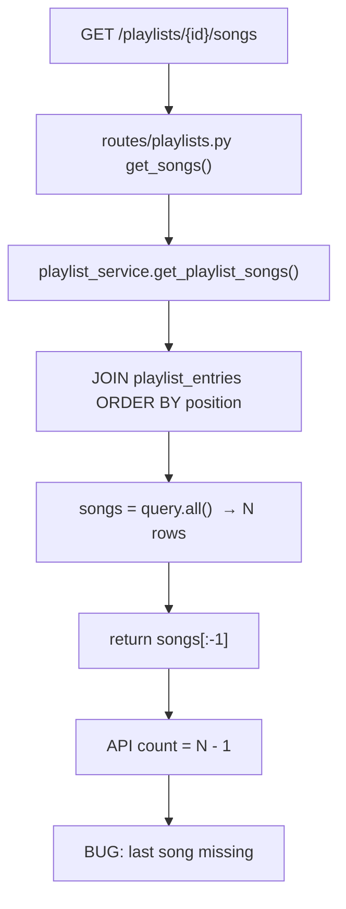
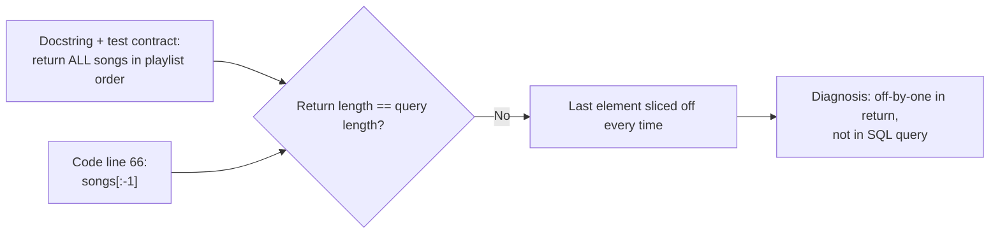
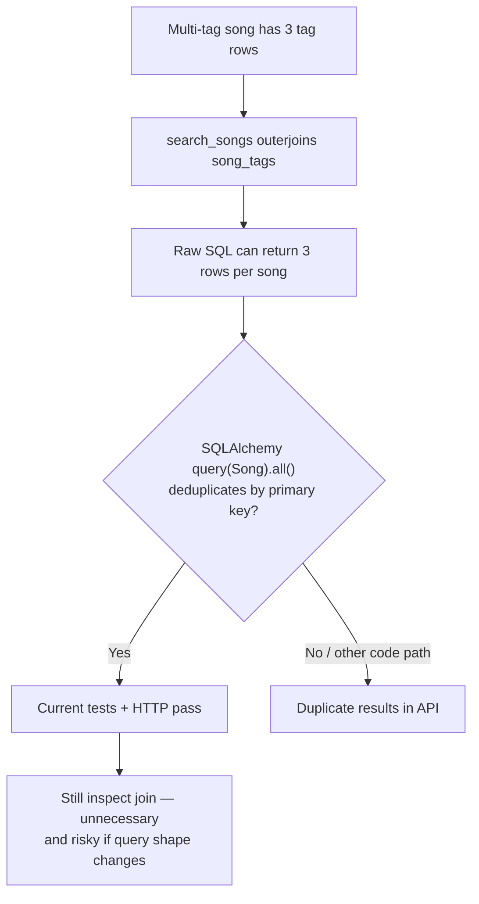
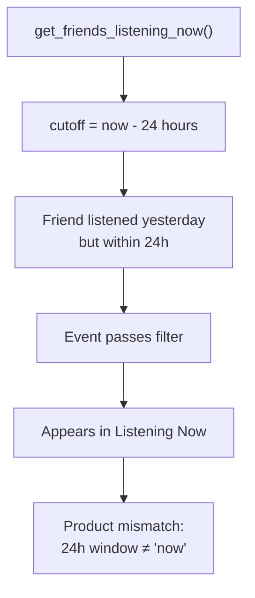
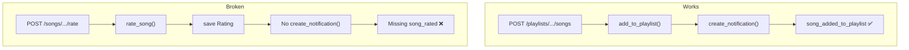

# Mixtape Bug Hunt — Submission

> **Status:** Pre-fix observations and diagnosis complete. Root cause analysis *fix verification* sections pending until after each `fix:` commit on `bugfix/mixtape`.

---

## AI Usage

- **Cursor:** Helped orient the repo, run `capture-observations.sh`, interpret pytest failures, and draft this submission structure. Suggested where bugs likely live based on tests and docstrings.
- **Microsoft Copilot (BookClub Tinker thread):** Provided the debugging workflow — trace route → service → model, treat tests as contracts, diagnose before fixing, use Mermaid for fault-isolation and contract-mismatch diagrams ([dialogue export](https://github.com/)).
- **Verified myself:** Ran `pytest tests/ -v` (3 failed, 10 passed), read `streak_service.py` and `playlist_service.py` to confirm docstring-vs-code mismatches, and reproduced Issue #5 over HTTP from a second machine (`05-remote-http-repro.txt`).

---

## Codebase Map (written before bug fixes)

### Main files

| File / directory | Role |
|------------------|------|
| `app.py` | Flask app factory, DB init, blueprint registration |
| `models.py` | SQLAlchemy models (`User`, `Song`, `Playlist`, `Tag`, join tables) |
| `routes/` | HTTP layer — parses requests, calls services, returns JSON |
| `services/` | Business logic (where the five bugs live) |
| `tests/` | pytest coverage for streak, search, playlist services |
| `seed_data.py` | Populates `mixtape.db` with users, songs, playlists, events |

### Pattern

Routes are thin; services hold the logic. Example: `GET /playlists/<id>/songs` → `routes/playlists.py` → `playlist_service.get_playlist_songs()`.

### Architecture (route → service → model)



### Data flow — song added to playlist + notification

1. `POST /playlists/<playlist_id>/songs` (`routes/playlists.py`)
2. → `notification_service.add_to_playlist()`
3. → adds song to playlist; if adder ≠ sharer, `create_notification()` with type `song_added_to_playlist`

### Data flow — listening streak

1. `POST /songs/<song_id>/listen` → `streak_service.record_listening_event()`
2. → creates `ListeningEvent`, calls `update_listening_streak(user, now)`
3. → updates `user.listening_streak` and `user.last_listened_at`

Additional diagrams: [`docs/diagrams.md`](docs/diagrams.md)

---

## Evidence baseline (captured before service edits)

| Artifact | Result |
|----------|--------|
| `pytest tests/ -v` | **3 failed, 10 passed** (see `observations/01-pytest-baseline.txt`) |
| Local API (test client) | `observations/02-api-repro.txt` |
| Remote HTTP (laptop → Mac mini) | `observations/05-remote-http-repro.txt` |
| Seed IDs | `observations/00-seed-ids.txt` |

**pytest failures:** `test_streak_increments_on_sunday`, `test_playlist_returns_all_songs`, `test_playlist_returns_songs_in_order`

**Chosen bugs to fix (≥3):** #1 streak, #5 playlist, plus #4 notifications (third — clear HTTP/code comparison path).

---

## Pre-Fix Observations & Diagnosis

### Issue #1 — Listening streak keeps resetting

#### How I reproduced it

```bash
cd ai201-project5-mixtape-starter
source .venv/bin/activate
pytest tests/test_streaks.py::test_streak_increments_on_sunday -v
```

#### Observed vs expected

| | |
|---|---|
| **Observed** | Saturday listen → streak 1. Sunday listen (next calendar day) → streak stays **1**. Failure: `assert 1 == 2`. |
| **Expected** | Consecutive calendar days increment streak (Saturday → Sunday → **2**). |
| **Trigger** | `days_since_last == 1` on a **Sunday** (`today.weekday() == 6`). |

#### Call chain



#### Contract vs implementation



#### Pre-fix diagnosis (before editing)

| | |
|---|---|
| **Docstring says** | Yesterday → increment; same day → no change; skip → reset. Based on **calendar days**. |
| **Code does** | Computes `days_since_last` correctly, but only increments when `today.weekday() != 6`. |
| **Mismatch** | Line 73 treats Sunday as a special case incompatible with the Saturday→Sunday test. |
| **Bug location** | `services/streak_service.py` line 73 |
| **Planned fix** | Increment whenever `days_since_last == 1`; remove weekday check. |
| **Verify** | `pytest tests/test_streaks.py -v` (all 5 pass) |

---

### Issue #5 — Last song in playlist never shows up

#### How I reproduced it

**pytest:**

```bash
pytest tests/test_playlists.py -v
```

**HTTP (remote laptop → `http://10.88.191.102:5000`):**

```bash
curl "http://10.88.191.102:5000/playlists/588519f8-e0d4-44c4-b5ba-7d0bf09dc95a/songs"
```

Evidence: `observations/05-remote-http-repro.txt`

#### Observed vs expected

| | |
|---|---|
| **pytest** | 5-song playlist returns **4** songs; titles `Track 1`…`Track 4` (missing `Track 5`). |
| **HTTP** | "Late Night Vibes" has **7** songs in DB; API `"count": 6`. Last song ("Free Throws" / position 7) missing. |
| **Expected** | Count matches all `playlist_entries` rows; ordered by `position`. |
| **Trigger** | Any playlist with ≥1 song; **last** entry always dropped. |

#### Call chain



#### Contract vs implementation



#### Pre-fix diagnosis (before editing)

| | |
|---|---|
| **Docstring says** | Returns all songs in playlist order. |
| **Code does** | Query is correct; return uses `songs[:-1]`. |
| **Mismatch** | Line 66 excludes the final song after a successful query. |
| **Bug location** | `services/playlist_service.py` line 66 |
| **Planned fix** | Return `songs` without `[:-1]`. |
| **Verify** | `pytest tests/test_playlists.py -v`; re-curl playlist endpoint (expect count 7). |

---

### Issue #3 — Same song shows up twice in search *(not reproduced on baseline)*

#### How I reproduced it

```bash
curl "http://10.88.191.102:5000/songs/search?q=Crown"
```

#### Observed vs expected

| | |
|---|---|
| **Observed** | `Crown Heights Anthem` (3 tags) appears **once**; `"count": 1`. All `test_search.py` tests **pass**. |
| **Expected (per test comment)** | Multi-tag song should appear exactly once — bug comment says it *would* appear 3× without fix. |
| **Status** | Conditional / latent — investigate join before fixing. |

#### Fault-isolation diagram



#### Pre-fix diagnosis

- `search_service.py` joins `song_tags` but only filters on title/artist — join may be dead code or latent duplicate source.
- **Not chosen as primary fix target** until reproduced; may fix defensively if time permits.

---

### Issue #2 — Friends Listening Now shows people from yesterday

#### How I reproduced it

```bash
curl "http://10.88.191.102:5000/feed/07e44d55-6f84-450b-a01b-2e79ebe9a5c5/listening-now"
```

Evidence: `observations/05-remote-http-repro.txt` — `"count": 3`

#### Observed vs expected

| | |
|---|---|
| **Observed** | 3 friends returned; e.g. darius `listened_at` ~20 min ago (within 24h window). |
| **Expected (issue brief)** | "Listening **Now**" should not show yesterday's listeners. |
| **Investigation** | `feed_service.RECENT_THRESHOLD = timedelta(hours=24)` may be too wide for "now". |

#### Threshold diagram



#### Pre-fix diagnosis

- Need project brief's intended window (e.g. 1 hour vs same calendar day).
- **Backup third bug** if #4 is fixed first.

---

### Issue #4 — Missing notification when friend rates song

#### How I reproduced it

```bash
curl "http://10.88.191.102:5000/users/07e44d55-6f84-450b-a01b-2e79ebe9a5c5/notifications"
```

#### Observed vs expected

| | |
|---|---|
| **Observed** | 1 notification: `song_added_to_playlist` (darius added Midnight Drive). |
| **Expected** | When a friend rates your shared song, sharer gets `song_rated` notification. |
| **Next step** | `POST /songs/<song_id>/rate` as darius; re-check notifications. |

#### Working vs broken path



#### Pre-fix diagnosis

- Compare `rate_song()` to `add_to_playlist()` — working path notifies sharer; rating path does not.
- **Chosen as third fix** — architectural pattern mismatch, not a one-character typo.

---

## Root Cause Analyses (complete after each fix)

*Template: issue title → reproduction → navigation → root cause → fix + side effects. Add Mermaid only if it clarifies. Fill in **Verified** rows after committing.*

### Issue #1 — Listening streak keeps resetting

| Field | Content |
|-------|---------|
| **Reproduction** | *(copy from Pre-Fix Observations above)* |
| **Navigation** | `test_streaks.py` → `update_listening_streak()` |
| **Root cause** | *(confirm after fix commit)* |
| **Fix & side effects** | *(fill after `fix:` commit + full streak test suite)* |
| **Verified** | ☐ `pytest tests/test_streaks.py` all pass |

### Issue #5 — Last song in playlist never shows up

| Field | Content |
|-------|---------|
| **Reproduction** | pytest + HTTP count 6 vs DB 7 |
| **Navigation** | `routes/playlists.py` → `get_playlist_songs()` line 66 |
| **Root cause** | *(confirm after fix commit)* |
| **Fix & side effects** | *(fill after commit)* |
| **Verified** | ☐ `pytest tests/test_playlists.py` all pass |

### Issue #4 — Missing rating notification

| Field | Content |
|-------|---------|
| **Reproduction** | *(fill after POST rate repro)* |
| **Navigation** | `routes/songs.py` → `rate_song()` vs `add_to_playlist()` |
| **Root cause** | *(pending)* |
| **Fix & side effects** | *(pending)* |
| **Verified** | ☐ notification appears after friend rates song |
